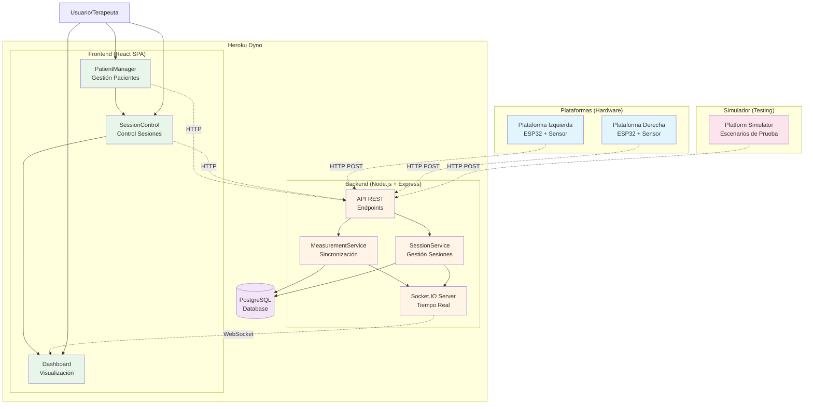
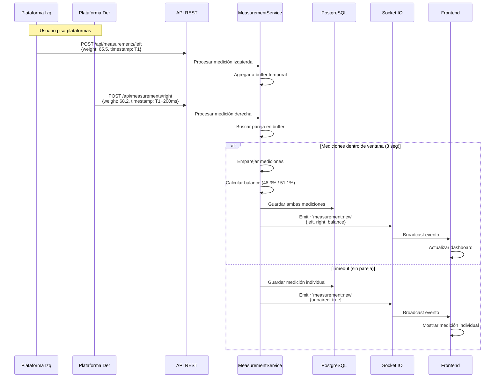
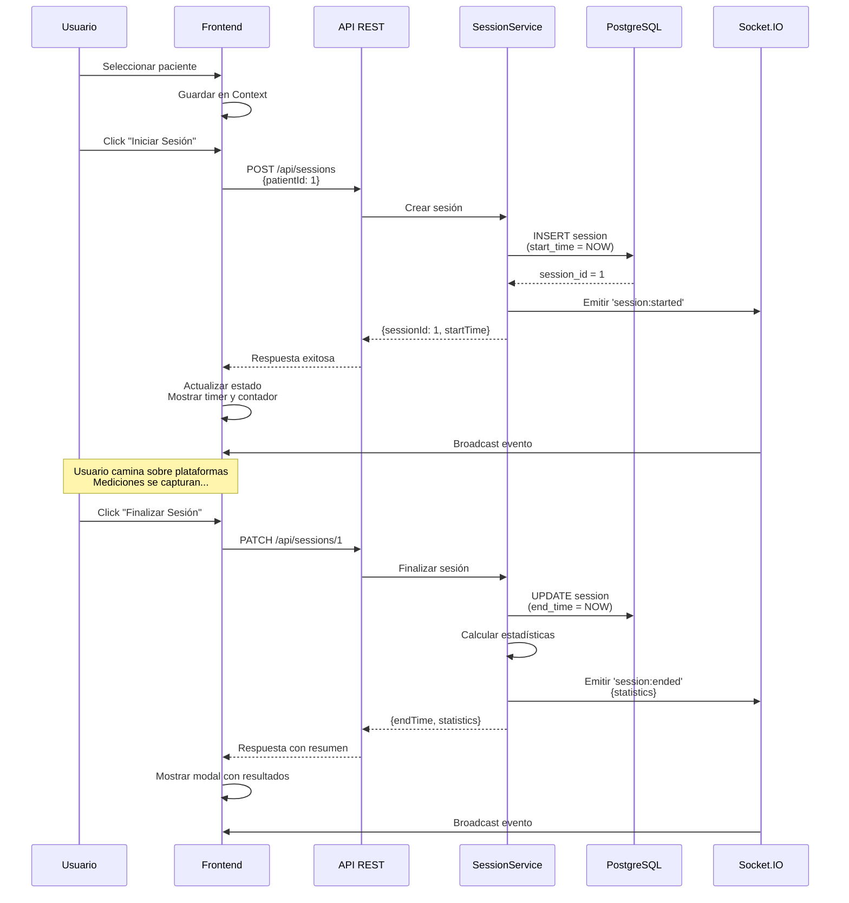
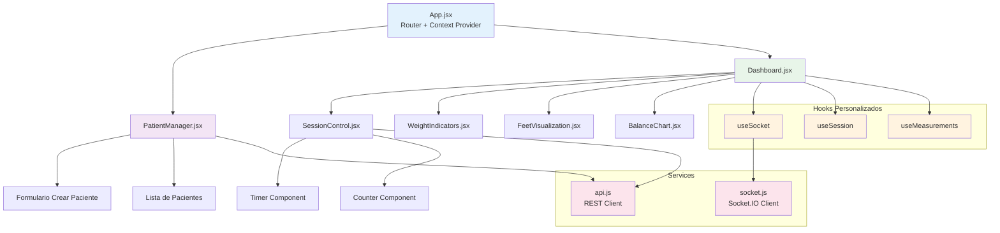
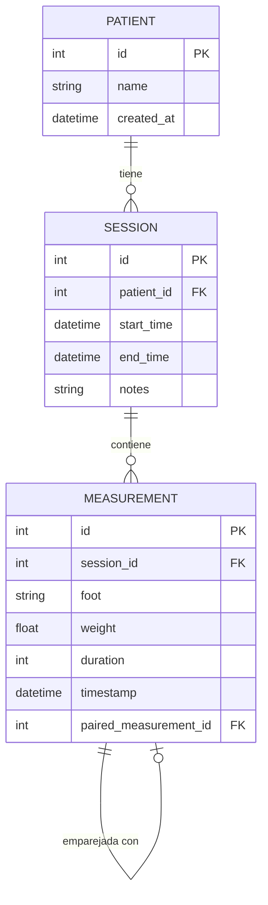
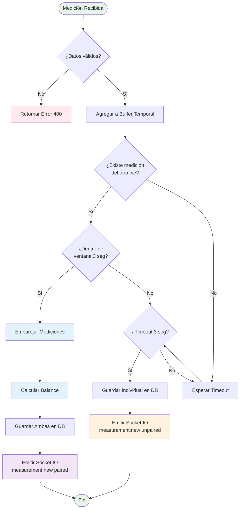
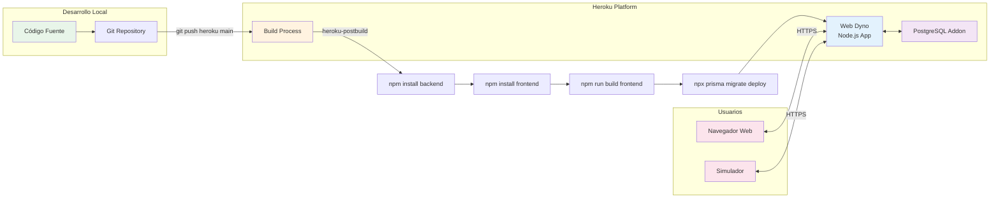
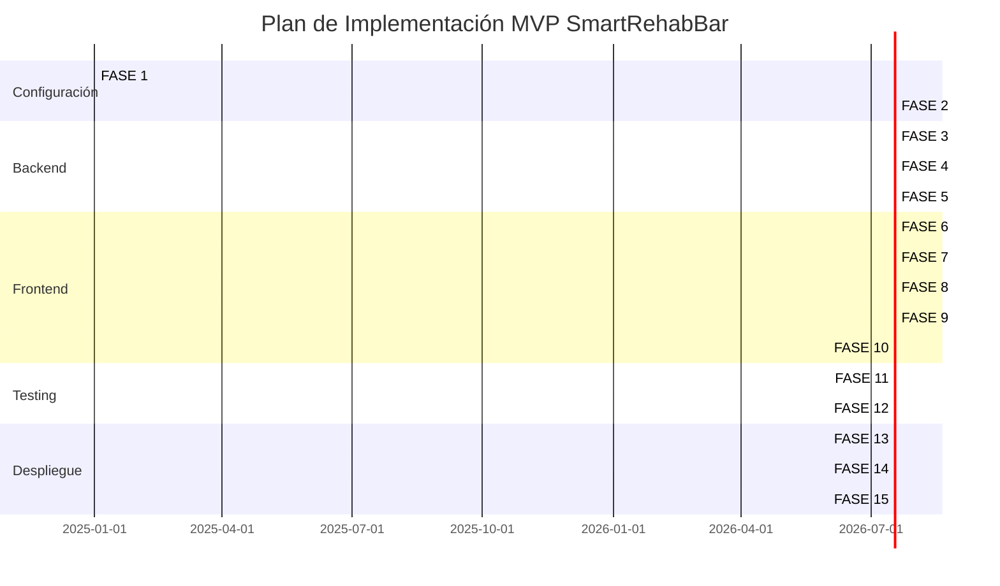

# Diagramas de Arquitectura - SmartRehabBar

Este documento contiene los diagramas visuales de la arquitectura del sistema en formato Mermaid.

---

## 1. Arquitectura General del Sistema

---

## 2. Flujo de Datos - Captura de Mediciones

---

## 3. Flujo de Gestión de Sesiones

---

## 4. Arquitectura de Componentes Frontend

---

## 5. Esquema de Base de Datos

---

## 6. Flujo de Sincronización de Mediciones

---

## 7. Despliegue en Heroku

---

## 8. Fases de Implementación

---

## Cómo Visualizar los Diagramas

### En VS Code
1. Instalar extensión "Markdown Preview Mermaid Support"
2. Abrir este archivo
3. Presionar `Ctrl+Shift+V` (o `Cmd+Shift+V` en Mac)

### En GitHub
Los diagramas Mermaid se renderizan automáticamente en GitHub

### Online
Copiar el código Mermaid y pegarlo en: https://mermaid.live/

---

**Documento creado:** 2025-10-03  
**Versión:** 1.0  
**Autor:** Equipo SmartRehabBar

